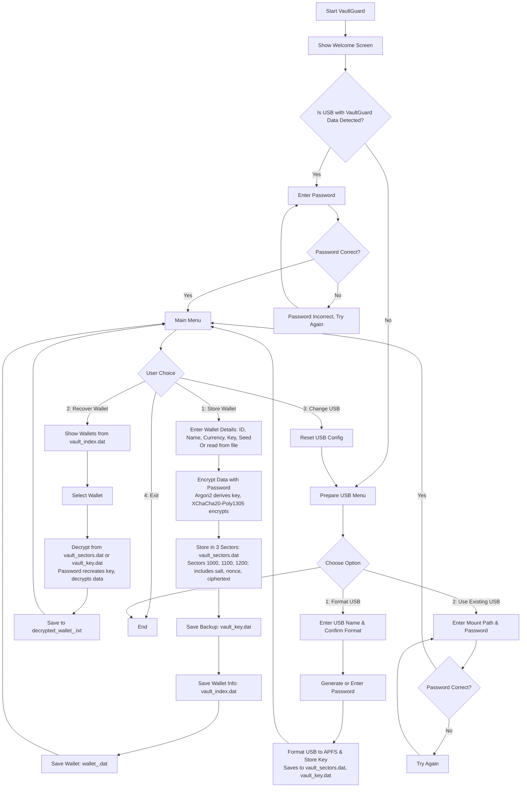

# VaultGuard

Secure Wallet Storage and Recovery Tool

## Overview

VaultGuard is a C++26 application for securely storing and recovering cryptocurrency wallets (private keys and seed phrases) on an encrypted USB drive. It leverages libsodium for strong cryptography, simulates a blockchain-like structure for redundancy, and supports cross-platform USB management.



### Key Features
- **Strong Encryption**: Uses Argon2 for key derivation and XChaCha20-Poly1305 for encryption.
- **Redundant Storage**: Stores keys in multiple sectors with a blockchain-like approach.
- **Filesystem Fallback**: Saves keys to a file if sector storage fails.
- **Cross-Platform**: Supports macOS, Linux, and Windows with USB detection and formatting.
- **Secure Input**: Validates user inputs and provides secure password generation.

## Dependencies
- **C++26 Compiler**: Clang, GCC, or MSVC with module support.
- **libsodium**: Automatically downloaded if not installed (or install manually).
- **CMake**: Version 3.26 or higher.

### Installing Dependencies
- **macOS** (Homebrew):
  ```bash
  brew install libsodium ninja
  ```
- **Linux** (Ubuntu):
  ```bash
  sudo apt-get install libsodium-dev ninja-build
  ```
- **Windows** (vcpkg):
  ```bash
  vcpkg install libsodium
  ```

## Build Instructions
1. Clone the repository:
   ```bash
   git clone https://github.com/thecompez/vaultguard.git
   cd vaultguard
   ```
2. Create and navigate to build directory:
   ```bash
   mkdir build
   cd build
   ```
3. Configure with CMake:
   ```bash
   cmake -G Ninja ..
   ```
   For Windows with vcpkg:
   ```bash
   cmake -G Ninja -DCMAKE_TOOLCHAIN_FILE=/path/to/vcpkg/scripts/buildsystems/vcpkg.cmake ..
   ```
4. Build:
   ```bash
   ninja
   ```
5. Install (optional):
   ```bash
   cmake --install .
   ```

This produces two executables: `vaultguard` (main app) and `recover_key` (recovery tool).

## Usage
- **Main App**:
  ```bash
  ./vaultguard
  ```
  Follow the menu to prepare a USB drive, store, or recover wallets.
- **Recovery Tool**:
  ```bash
  ./recover_key <mount_path> <password>
  ```
  Example:
  ```bash
  ./recover_key /Volumes/VAULT my_secure_password
  ```

**Warning**: Run VaultGuard offline on a trusted system (e.g., Tails OS) with a connected USB drive to ensure security.

## Project Structure
- `src/`: Source files (`main.cpp`, `recover_key.cpp`).
- `include/`: C++ modules (`block.cppm`, `crypto.cppm`, `file.cppm`, `utils.cppm`, `wallet.cppm`).
- `CMakeLists.txt`: Build configuration.

## Contributing
1. Fork the repository.
2. Create a feature branch: `git checkout -b my-feature`.
3. Commit changes: `git commit -m "Add my feature"`.
4. Push to the branch: `git push origin my-feature`.
5. Open a pull request.

Follow C++ best practices and include tests where possible.

## License
MIT License. See [LICENSE](LICENSE) for details.

## ⚠️ Security Notice

VaultGuard is currently an **alpha version** and a proof-of-concept. While it uses strong cryptographic methods (Argon2 and XChaCha20-Poly1305 via libsodium), it is still under active development and **not yet production-ready**. Potential risks include:

- **Data Loss**: Forgetting the password will render stored data unrecoverable, as no backdoor or recovery mechanism exists.
- **Hardware Failure**: If the USB drive fails and no backups are made, data may be lost despite redundancy features.
- **Untested Edge Cases**: The software has not been thoroughly tested in all scenarios, which could lead to unexpected behavior.

Use VaultGuard **at your own risk** in a secure, offline environment (e.g., Tails OS) for testing purposes only. Always maintain secure backups of your passwords and data. We are actively working to improve stability, security, and add features like Geny token support in future releases.

## Notes
- Ensure `libsodium` is installed or let CMake download it automatically.
- For Windows, set `CMAKE_TOOLCHAIN_FILE` if using vcpkg.
- Test thoroughly on a secure, offline system before storing sensitive data.